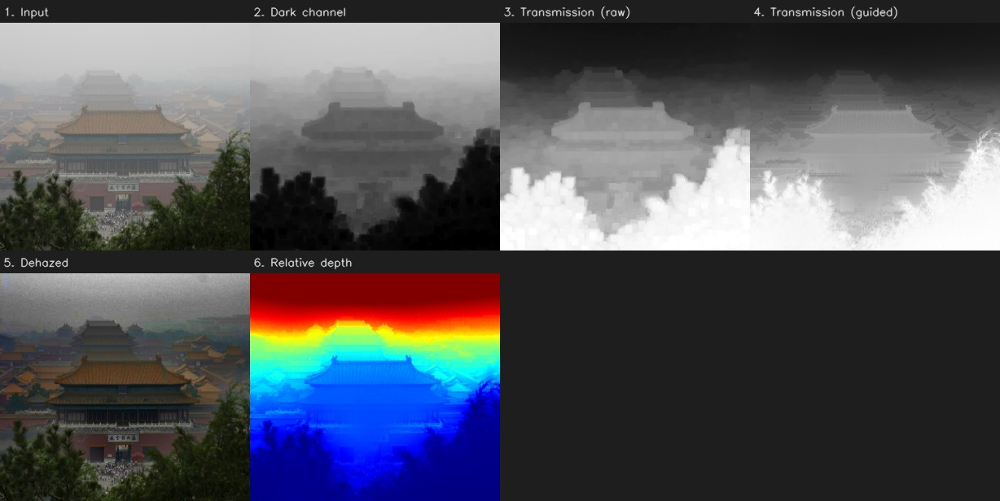
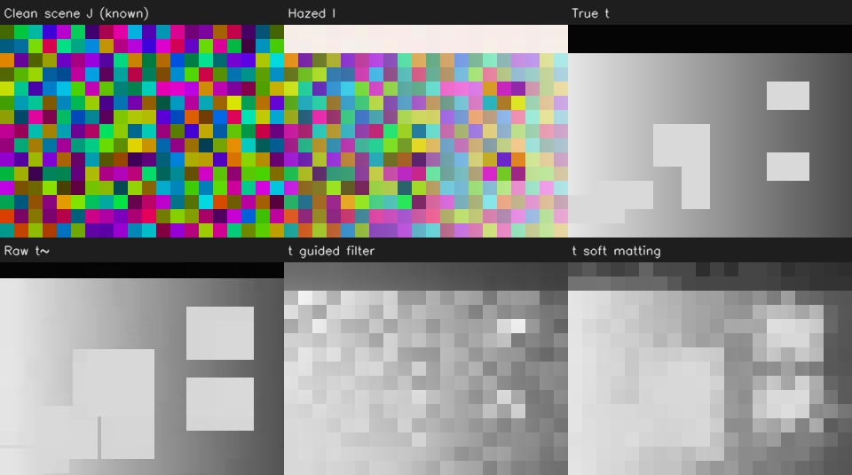
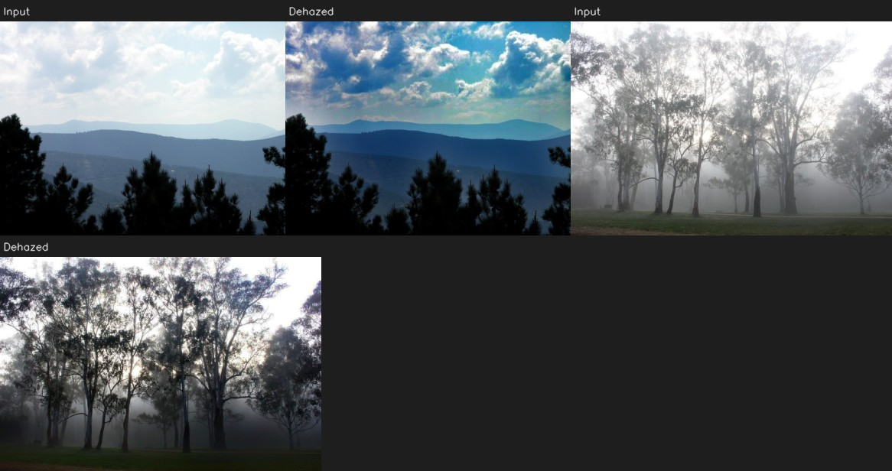
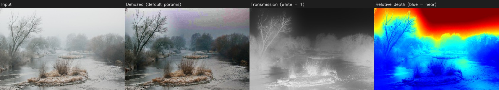
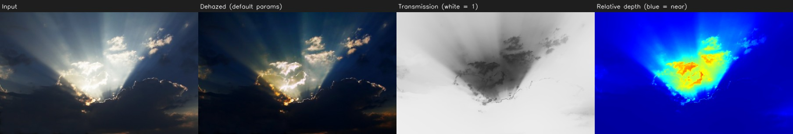

# Dark Channel Prior dehazing: a tested reproduction

[](https://github.com/ElMazrouaCS/dehazing-dcp/actions/workflows/ci.yml)

Reproduction of **"Single Image Haze Removal Using Dark Channel Prior"**
(K. He, J. Sun, X. Tang, CVPR 2009), with both transmission refinements
(the paper's **soft matting** and the faster **guided filter**), a controlled
evaluation on synthetic haze with known ground truth, and timings measured on
my own laptop.

This is a 2009, learning-free method, so the goal isn't to beat the state of
the art. The goal was to implement a paper properly, measure what it actually
does, and be upfront about where it breaks.

<p align="center">
  
</p>

## Method

Haze is modelled as `I(x) = J(x) t(x) + A (1 - t(x))`: the observed image `I`
mixes the clean scene `J` and the atmospheric light `A`, weighted by the
transmission `t = exp(-β d)`. With one image, `J`, `t` and `A` are all unknown.

| Step | What it does | Module |
|---|---|---|
| Dark channel | `min` over colour channels and a 15×15 patch; ≈ 0 on haze-free outdoor patches (the prior) | `dcp/prior.py` |
| Atmospheric light `A` | brightest input pixel among the 0.1 % most haze-opaque pixels of the dark channel | `dcp/prior.py` |
| Raw transmission `t~` | `1 − ω · dark(I / A)`, ω = 0.95 | `dcp/prior.py` |
| Refinement | soft matting: solve `(L + λI) t = λ t~` with the matting Laplacian (sparse, conjugate gradient), or guided filter (box filters, O(N)) | `dcp/refine.py` |
| Recovery | `J = (I − A) / max(t, t0) + A`, t0 = 0.1 | `dcp/recover.py` |
| Relative depth | `−ln t` = β·d, known up to the unknown β | `dcp/recover.py` |

The guided filter isn't in the 2009 paper, He et al. added it a year later
(ECCV 2010), but it's the fast alternative I benchmark against soft matting
throughout this README.

## Results

### 1. Controlled experiment: synthetic haze with known `J`, `t`, `A`

Real hazy photos almost never come with an exact haze-free reference, so I
start the quantitative evaluation where the ground truth actually is exact:
scenes generated so the prior holds by construction, hazed with a known `t`
and `A` (`dcp/synthetic.py`). 20 random scenes per setting, ω = 1, metrics on
the non-sky region. Reproduce with `python scripts/synthetic_experiment.py --layout {gradient,objects}`.

**Smooth depth only** (`gradient`), checks the estimation itself:

| Method | t MAE | PSNR (dB) | SSIM |
|---|---|---|---|
| Hazy input (baseline) | — | 11.13 ± 0.06 | 0.662 ± 0.004 |
| Raw transmission | 0.021 ± 0.001 | 29.98 ± 0.10 | 0.937 ± 0.004 |
| Guided filter | 0.043 ± 0.002 | 24.92 ± 0.21 | 0.919 ± 0.004 |
| Soft matting | 0.021 ± 0.001 | 29.18 ± 0.18 | 0.936 ± 0.005 |

**Depth discontinuities aligned with colour edges** (`objects`), the case
refinement is designed for:

| Method | t MAE | PSNR (dB) | SSIM |
|---|---|---|---|
| Hazy input (baseline) | — | 12.14 ± 0.51 | 0.694 ± 0.015 |
| Raw transmission | 0.063 ± 0.016 | 20.24 ± 2.13 | 0.879 ± 0.022 |
| Guided filter | 0.083 ± 0.015 | 20.15 ± 1.37 | 0.870 ± 0.016 |
| Soft matting | 0.062 ± 0.014 | 20.61 ± 2.01 | 0.882 ± 0.019 |

Paired differences on the same scenes (`objects`): soft matting − raw =
**+0.37 ± 0.20 dB, better on 20/20 scenes**; guided filter − raw =
−0.09 ± 0.86 dB, better on 10/20.

<p align="center">
  
</p>
A few things come out of this. The estimation behaves the way the model
predicts: `A` lands within about 5 grey levels of the true value, and `t~`
within ~0.02, whenever the prior actually holds (also checked in
`tests/test_synthetic_haze.py`). The raw `t~` is biased near depth edges,
near objects "grow" by roughly a patch radius, which is exactly what
refinement is supposed to fix, and soft matting does reduce that error, just
not by much. Both refinements also copy image texture into `t`, visible in
the figure above; the guided filter suffers more here because its guide is
grey-level only. These synthetic scenes are a worst case for that effect
(every 8×8 tile is a different colour), so treat this as an upper bound
rather than a measurement on natural images.

### 2. Paired-dataset benchmark (RESIDE SOTS-outdoor)

30 random pairs (seed 0) out of 500, native resolution, paper default
parameters. Raw results in `results/sots_outdoor/`.

    python scripts/benchmark_dataset.py --hazy data/sots_outdoor/hazy \
        --gt data/sots_outdoor/gt --limit 30 --seed 0 --out results/sots_outdoor

| Method | PSNR (dB) | SSIM |
|---|---|---|
| Hazy input (baseline) | 16.15 ± 2.77 | 0.830 ± 0.071 |
| Guided filter | 17.12 ± 4.16 | 0.872 ± 0.050 |
| Soft matting | 17.09 ± 4.11 | 0.868 ± 0.050 |

Paired differences on the same images:
guided − input = +0.97 ± 5.64 dB (better on 16/30), +0.042 ± 0.097 SSIM (better on 19/30);
soft matting − input = +0.94 ± 5.61 dB (better on 17/30), +0.037 ± 0.095 SSIM (better on 19/30);
soft matting − guided = −0.03 ± 0.19 dB (better on 17/30), −0.005 ± 0.006 SSIM (better on 5/30).

On this sample both methods beat the untouched input on average, but not
reliably, PSNR only improves on about half the images, and the spread
(±5.6 dB) is much bigger than the average gain (~1 dB). So on a chunk of
images the DCP is making things worse, probably the same bright-surface and
sky cases shown further down. SSIM is more consistent (19/30). Guided filter
and soft matting land on essentially the same numbers here (the gap is well
inside the noise), so given the ~1000× speed difference, guided filter is
the one to default to.

### 3. Speed

Median of 5 runs after one warm-up, `examples/forbidden_city_smog.jpg` (600×546).
Environment: Intel Core i5-6300U @ 2.40GHz (laptop), Python 3.11.0, NumPy 2.4.4,
SciPy 1.17.1, OpenCV 4.13.0, raw data in `results/timing/`.
Reproduce with `python scripts/benchmark_timing.py examples/forbidden_city_smog.jpg --size-sweep`.

| Stage | Guided filter | Soft matting |
|---|---|---|
| Dark channel + A + raw t | 0.084 s | 0.119 s |
| Refinement | **0.050 s** | **57.34 s** (Laplacian 6.26 s, CG solve 50.50 s, 1803 iterations) |
| Total pipeline | 0.187 s | 57.56 s |

Refinement time vs image size (same image, downscaled):

| Width (px) | 150 | 300 | 450 | 600 |
|---|---|---|---|---|
| Guided filter | 0.0018 s | 0.0111 s | 0.0306 s | 0.0525 s |
| Soft matting | 3.69 s | 11.12 s | 32.97 s | 38.21 s |

At full size, soft matting is about 1150× slower than the guided filter, and
88 % of that time is the conjugate-gradient solve, λ = 1e-4 makes the system
badly conditioned. Memory is the other limit: building the Laplacian needs
~22 M COO entries (~350 MB) at 600×546, so anything bigger gets solved on a
downscaled copy instead (`--sm-max-side`). That downscaling is logged and
shows up in the report, never silently.

One thing worth flagging: the size-sweep run at 600 px (3 repeats) gave
38.2 s for soft matting, well under the 57.6 s median from the dedicated
5-repeat run at the same size. That's about 30 % run-to-run variance on a
dual-core laptop, probably CPU throttling, and it's bigger than some of the
gaps being compared elsewhere in this table. I used the 5-repeat number above
since it's the more careful measurement.

### 4. Qualitative results



The first scene is Tiananmen Gate under dense haze, and it isn't a random
pick, it's the paper's own featured demo image, hosted on the authors'
project page as their main input example. The second is a street front with
dense signage, origin unverified (see the note in `examples/SOURCES.md`),
kept because the many small colour patches make it a good case for the
prior.

Dense urban smog is otherwise a hard case for this method: on
`examples/forbidden_city_smog.jpg` (used for the speed benchmark below), the
same default parameters darken the image and add noise without a clear gain
in clarity. That one is kept only for timing, since speed doesn't care what
the output looks like.

Example images come from Wikimedia Commons (authors and licences in
[`examples/SOURCES.md`](examples/SOURCES.md)).

## Limitations (observed)

**Bright surfaces (snow, white walls).** Their dark channel is high without
any haze, so the prior reads them as dense haze: they get assigned a low
transmission (treated as far away), and the recovery over-corrects them,
amplifying noise where `t` is small. In the figure, the frosted branches and
hazy sky come out with a visible purple/green cast and grain, worse than the
mild haze already in the input.



**Coloured, non-uniform illumination (sunset).** The model assumes one
global, uniform `A`. A saturated blue sky has a low dark channel, so it's
read as *near* and haze-free, while the bright band around the sun is read
as dense haze, you can see it in the output: the blue sky turns much more
saturated, almost inky, while the warm halo around the sun darkens instead
of clearing, the opposite of what dehazing is supposed to do there.



Other limits:
- Patch size and guided-filter radius are in pixels, so the same parameters
  behave differently at different resolutions.
- The depth map is relative (β unknown) and saturates at `−ln t0`.
- PSNR/SSIM penalise the global darkening typical of DCP outputs; a single
  image pair is not evidence of anything. This is why the evaluation above
  uses known ground truth and paired differences.

## Usage

```bash
git clone https://github.com/ElMazrouaCS/dehazing-dcp.git && cd dehazing-dcp
python -m venv .venv && source .venv/bin/activate   # Windows: .venv\Scripts\activate
pip install -e ".[dev]"                              # or the exact versions: see requirements-lock.txt

pytest                                               # 32 tests, < 2 s

dcp run examples/forbidden_city_smog.jpg --out results/run --save-all
dcp run examples/forbidden_city_smog.jpg --method soft_matting --out results/run_sm
dcp compare examples/morning_mist_forest.jpg --out results/compare
dcp sweep examples/temple.jpg --param omega --values 0.75 0.85 0.95 1.0 --out results/sweep
dcp run --help                                        # every parameter is exposed
```

Each run writes a `*_report.json` with the resolved parameters, the estimated
`A`, per-stage timings and what the refinement actually did (downscaling,
solver convergence, fallback). If `--gt` is given, metrics always include the
hazy input as a baseline.

Reproduce every number and figure of this README:

```bash
python scripts/fetch_examples.py        # example images + examples/SOURCES.md
python scripts/synthetic_experiment.py --layout gradient
python scripts/synthetic_experiment.py --layout objects
python scripts/benchmark_timing.py examples/forbidden_city_smog.jpg --size-sweep
python scripts/make_figures.py --out docs/figures
```

## Repository layout

```
src/dcp/        prior.py  refine.py  recover.py  pipeline.py  metrics.py
                synthetic.py  datasets.py  viz.py  cli.py
scripts/        synthetic_experiment.py  benchmark_timing.py
                benchmark_dataset.py  make_figures.py  fetch_examples.py
tests/          unit tests, synthetic-haze tests, CLI tests
results/        raw outputs (CSV/JSON) behind the tables above
docs/figures/   figures, all regenerated by scripts/make_figures.py
examples/       input images from Wikimedia Commons (sources.json -> SOURCES.md)
```

A few engineering choices worth calling out:
- Nothing happens silently: downscaling and solver fallback are logged and
  recorded in `RefineInfo`.
- Metrics refuse mismatched shapes instead of quietly resizing one of the images.
- Transmission and depth maps are saved with fixed scales, so different
  images and methods stay comparable.
- PSNR/SSIM are checked against scikit-image in the test suite.
- CI runs lint, tests, and a smoke test on both locked and latest dependencies.

## References

- K. He, J. Sun, X. Tang. *Single Image Haze Removal Using Dark Channel Prior.* CVPR 2009.
- K. He, J. Sun, X. Tang. *Guided Image Filtering.* ECCV 2010.
- A. Levin, D. Lischinski, Y. Weiss. *A Closed-Form Solution to Natural Image Matting.* CVPR 2006.
